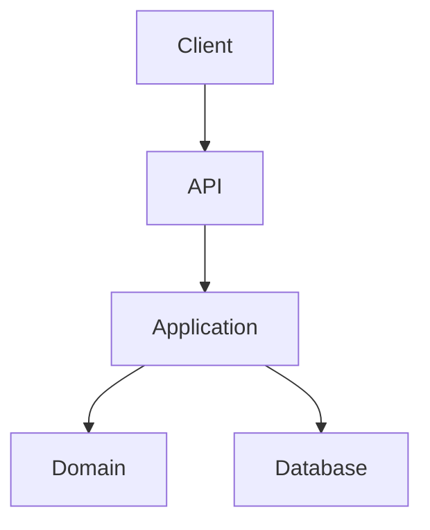

# Architecture Skill

## Purpose

Design production-grade software architecture before implementation.

This skill is mandatory whenever:

- creating a new service
- introducing a new major feature
- introducing a new infrastructure component
- changing persistence architecture
- introducing Kafka
- introducing Redis/cache
- introducing Elasticsearch/OpenSearch
- changing service boundaries
- changing communication patterns
- changing deployment topology
- making a scalability decision

---

# STEP 1 — Understand the Requirement

Before designing anything, extract:

### Functional requirements

Identify:

- actors
- use cases
- inputs
- outputs
- business rules
- state transitions
- external integrations

### Non-functional requirements

Identify where known:

- expected requests per second
- peak traffic
- latency requirements
- availability requirements
- consistency requirements
- durability requirements
- data retention
- security requirements
- compliance requirements
- deployment environment
- cost constraints

If information is unavailable, explicitly state assumptions.

Do NOT invent requirements silently.

---

# STEP 2 — Identify System Boundaries

Determine:

- what belongs inside the service
- what belongs outside the service
- data owned by this service
- data owned by other services
- synchronous dependencies
- asynchronous dependencies

Create a responsibility table:

| Component | Responsibility | Owner |
|---|---|---|

Avoid duplicated ownership of the same business data.

---

# STEP 3 — Decide Monolith vs Modular Monolith vs Microservice

Do not automatically create microservices.

Evaluate:

### Monolith

Prefer when:

- domain is small
- team is small
- independent scaling is unnecessary
- deployment simplicity is important

### Modular monolith

Prefer when:

- domain has clear boundaries
- independent modules are useful
- operational simplicity is still important

### Microservices

Prefer only when justified by:

- independent scaling
- independent deployment
- strong bounded contexts
- team ownership
- isolation requirements
- independent availability requirements

Explain the decision.

---

# STEP 4 — Determine Data Ownership

For every major entity identify:

- owning service
- storage
- read/write responsibility
- consistency model

Do not allow multiple services to directly modify the same database tables unless explicitly justified.

Prefer:

Service A
    ↓
Service A Database

Service B
    ↓
Service B Database

rather than:

Service A ─┐
            ├── Shared Database
Service B ─┘

---

# STEP 5 — Choose Communication Pattern

For every service interaction determine:

### REST/HTTP

Use when:

- immediate response required
- synchronous workflow
- request/response semantics

### Kafka/event

Use when:

- asynchronous processing is acceptable
- decoupling is valuable
- event history/replay is useful
- multiple consumers need the event

### Batch

Use when:

- processing is periodic
- real-time processing isn't required

Do not introduce asynchronous processing simply to appear scalable.

---

# STEP 6 — Identify Bottlenecks

Evaluate:

- CPU
- memory
- database
- network
- external APIs
- connection pools
- thread pools
- locks
- queues
- disk I/O

Identify likely bottlenecks before selecting scaling strategies.

---

# STEP 7 — Design Scaling Strategy

Determine independently:

- compute scaling
- read scaling
- write scaling
- database scaling
- cache scaling
- message processing scaling

Prefer horizontal scaling for stateless application services.

Do not introduce sharding unless simpler approaches are insufficient.

---

# STEP 8 — Evaluate Infrastructure

Only introduce infrastructure when justified.

Evaluate:

- PostgreSQL/MySQL
- Redis
- Kafka
- Elasticsearch/OpenSearch
- object storage
- Kubernetes
- API Gateway
- service discovery

For every infrastructure dependency provide:

1. reason
2. alternative
3. operational cost
4. failure mode
5. scaling behavior

---

# STEP 9 — Produce Architecture Diagram

Every significant architecture change must produce Mermaid diagrams.

At minimum:



# STEP 10 — Define Package Boundaries

Prefer responsibility-oriented packages.

Example:

```text
com.company.orders
├── api
├── application
├── domain
├── infrastructure
└── config
```

Avoid giant packages such as:

```text
controller/
service/
repository/
```

when the application has multiple independent domains.

---

# STEP 11 — Define Module Boundaries

Use Maven multi-module architecture when justified.

Example:

```text
order-api
order-application
order-domain
order-infrastructure
order-bootstrap
```

Dependency direction should generally be:

```text
api
↓
application
↓
domain
```

```text
infrastructure
↓
application/domain
```

Infrastructure must not become the owner of business rules.

---

# STEP 12 — Create ADR

For meaningful architectural decisions create:

```text
docs/adr/NNN-decision-name.md
```

Include:

- Context
- Problem
- Options considered
- Decision
- Reasons
- Trade-offs
- Consequences
- Future reconsideration conditions

---

# STEP 13 — Architecture Review

Before implementation verify:

- Is the architecture unnecessarily complex?
- Are responsibilities clear?
- Is data ownership clear?
- Are dependencies directional?
- Can services scale?
- What happens if dependencies fail?
- What happens during retries?
- Is the design observable?
- Is it secure?
- What is the operational cost?
- What breaks at 10x traffic?

Only then proceed to implementation.

---

## Definition of Done

Architecture is complete when:

- requirements are understood
- assumptions are documented
- component boundaries are defined
- data ownership is defined
- communication pattern is defined
- scaling strategy is defined
- infrastructure choices are justified
- diagrams exist
- package/module boundaries exist
- ADR exists for significant decisions