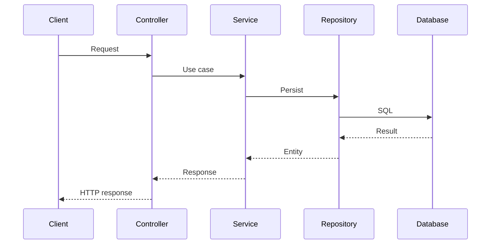

# Documentation Skill

## Purpose

Keep architecture and onboarding documentation synchronized with implementation.

---

# STEP 1 — Create Architecture Document

Every service must have:

```text
docs/ARCHITECTURE.md
```

---

# STEP 2 — Document Purpose

Explain:

- what the service does
- why it exists
- what it owns

---

# STEP 3 — Document Boundaries

Explain:

- responsibilities
- non-responsibilities
- dependencies
- data ownership

---

# STEP 4 — Architecture Diagram

Use Mermaid.

---

# STEP 5 — Sequence Diagram

Document important workflows.

Example:



---

# STEP 6 — Database Documentation

Document:

- schema
- tables
- indexes
- important queries
- transaction boundaries

---

# STEP 7 — Kafka Documentation

Document:

- topics
- producers
- consumers
- keys
- partitions
- retries
- DLQ

---

# STEP 8 — Cache Documentation

Document:

- cache
- keys
- TTL
- invalidation
- fallback

---

# STEP 9 — Configuration

Document:

- local
- qa
- prod
- configuration differences

---

# STEP 10 — Local Setup

Provide exact commands.

Example:

```bash
./mvnw clean verify
docker compose up -d
./mvnw spring-boot:run
```

---

# STEP 11 — Troubleshooting

Document common operational failures.

---

# STEP 12 — Architecture Updates

Whenever implementation materially changes architecture:

- update ARCHITECTURE.md
- update diagrams
- update dependencies
- update configuration
- create/update ADR if decision is significant

Never allow documentation to become stale.

---

## Definition of Done

A new developer should be able to understand and run the service using the documentation without reading the complete source code.

---