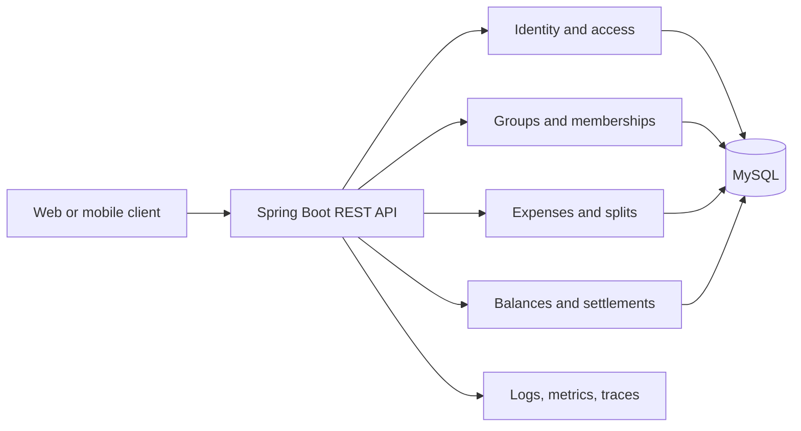
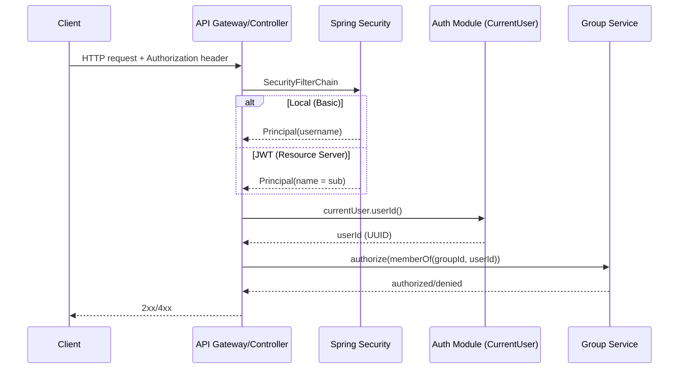

# Splitwise Expense Tracker Architecture

## Context

Splitwise is a group expense tracker. A user can create a group, invite or add members, record an expense paid by one or more members, and see what each member owes or is owed. The system must preserve money accurately and make balances understandable without requiring users to perform calculations themselves.

The initial product is designed as a responsive web application backed by a Spring Boot API. The design favors a modular monolith so that expense writes and balance reads share one transaction boundary while the product is still small.

## Goals

- Create groups and manage group membership.
- Record expenses with a description, date, currency, payer, participants, and split method.
- Show each member their total paid, total share, net balance, and bilateral debts.
- Record settlements and remove the settled amount from outstanding balances.
- Enforce authorization so users can only access groups they belong to.
- Keep monetary calculations deterministic, auditable, and safe from floating-point errors.
- Provide a foundation for notifications, recurring expenses, and multiple currencies later.

## Non-goals for the MVP

- Cross-currency expense conversion.
- Bank or card integrations.
- Automatic receipt OCR.
- Optimizing debts into the fewest possible transfers.
- Public groups or anonymous access.

## Recommended architecture

Use a modular monolith with clear domain modules:



The API, domain logic, and persistence run in one deployable service. Modules communicate through application services rather than directly reaching into each other's repositories.

## Domain model

### User

- `id`: UUID
- `email`: unique, normalized
- `displayName`
- `passwordHash` or external identity subject
- `createdAt`, `updatedAt`

### Group

- `id`: UUID
- `name`
- `defaultCurrency`: ISO 4217 code, for example `USD`
- `createdBy`
- `createdAt`, `archivedAt`

### Membership

Associates a user with a group.

- `groupId`, `userId`: composite unique key
- `role`: `OWNER` or `MEMBER`
- `status`: `ACTIVE` or `REMOVED`
- `joinedAt`, `removedAt`

Historical expenses retain their original user references. Removing a member prevents new activity but does not erase history.

### Expense

- `id`: UUID
- `groupId`
- `description`
- `amountMinor`: positive integer in the currency's minor unit
- `currency`: must match the group currency in the MVP
- `paidAt`
- `createdBy`
- `splitMethod`: `EQUAL`, `EXACT`, or `PERCENTAGE`
- `createdAt`, `updatedAt`

### Expense share

One row per participant. It is the amount that participant owes for the expense.

- `expenseId`
- `userId`
- `shareMinor`: non-negative integer
- `percentageBasisPoints`: optional audit value for percentage splits

The sum of all shares must equal `Expense.amountMinor`.

### Expense payment

One row per payer. It supports the simple MVP case of one payer and leaves room for multiple payers.

- `expenseId`
- `userId`
- `paidMinor`: positive integer

The sum of all payments must equal `Expense.amountMinor`.

### Settlement

- `id`: UUID
- `groupId`
- `fromUserId`: the member paying back
- `toUserId`: the member receiving money
- `amountMinor`: positive integer
- `currency`
- `settledAt`
- `createdBy`

Settlements are immutable financial records. Corrections should be represented by a reversing settlement rather than editing history.

## Balance calculation

For each user in a group:

```text
netBalance = totalPaid - totalShare + settlementsReceived - settlementsPaid
```

- A positive value means the group owes that user.
- A negative value means that user owes the group.
- Zero means the user is settled.

For a direct bilateral view from member A to member B, aggregate the expense shares and payments between those two users and apply settlements. The API should return a signed balance plus a human-readable direction, rather than making clients infer signs.

Balances are derived from expense, share, payment, and settlement records. They should not be independently edited. For MVP scale, calculating them with indexed SQL queries on request is simpler and avoids stale denormalized state. A later read model can be introduced if measurements show that balance queries need it.

## Expense rules

1. The caller must be an active group member.
2. Every payer and participant must be an active member at creation time.
3. `amountMinor` must be positive; decimal money values are converted and validated at the API boundary.
4. A group expense has exactly one currency in the MVP.
5. Equal splitting uses integer division and assigns any remainder deterministically to the first participant after sorting by user ID.
6. Exact shares must sum exactly to the expense amount.
7. Percentage shares must total exactly 10,000 basis points.
8. The payer total and share total must each equal the expense amount.
9. An expense is written atomically with all shares and payments.
10. Editing or deleting an expense is restricted to the creator or group owner and must leave an audit trail. A later MVP iteration can instead make expenses immutable and use reversals.

## REST API

All endpoints require an authenticated user. IDs are UUIDs and responses use DTOs rather than persistence entities.

### Groups

```text
POST   /api/v1/groups
GET    /api/v1/groups
GET    /api/v1/groups/{groupId}
PATCH  /api/v1/groups/{groupId}
POST   /api/v1/groups/{groupId}/members
DELETE /api/v1/groups/{groupId}/members/{userId}
```

### Expenses

```text
POST   /api/v1/groups/{groupId}/expenses
GET    /api/v1/groups/{groupId}/expenses?from=&to=&page=&size=
GET    /api/v1/groups/{groupId}/expenses/{expenseId}
PATCH  /api/v1/groups/{groupId}/expenses/{expenseId}
DELETE /api/v1/groups/{groupId}/expenses/{expenseId}
```

Example create request:

```json
{
  "description": "Dinner",
  "amountMinor": 12000,
  "currency": "USD",
  "paidAt": "2026-09-08",
  "payments": [{ "userId": "payer-id", "paidMinor": 12000 }],
  "split": {
    "method": "EQUAL",
    "participants": ["user-a-id", "user-b-id", "user-c-id"]
  }
}
```

### Balances and settlements

```text
GET  /api/v1/groups/{groupId}/balances
GET  /api/v1/groups/{groupId}/balances/me
POST /api/v1/groups/{groupId}/settlements
GET  /api/v1/groups/{groupId}/settlements
```

The balance response should include `totalPaidMinor`, `totalShareMinor`, `netBalanceMinor`, `direction` (`OWES`, `OWED`, `SETTLED`), and bilateral `debts` with `fromUser`, `toUser`, and `amountMinor`.

Use idempotency keys on expense and settlement creation. Store the key per authenticated user and group with a unique constraint, so client retries cannot create duplicate financial records.

### Authentication & authorization



- CORS is configurable via `security.cors.allowed-origins`.
- Local: Basic auth with in-memory users.
- Prod: OAuth2 resource server validates JWT; map `sub` to internal `app_user.id` or via custom claim when available.

## User experience

The first screen after sign-in is a group list with each group's net balance. A group view contains:

- Summary: total you paid, your share, and your net position.
- Who owes whom: bilateral debts with a `Settle up` action.
- Expense history: description, date, payer, participants, and your share.
- Members: active members and their current net balances.

The add-expense flow should validate the split live, show the resulting per-person amounts, and refuse submission until the shares and payment totals reconcile.

## Module boundaries

```text
com.example.splitwise
  auth/          authentication, current-user access
  user/          user profile and lookup
  group/         groups, memberships, authorization policies
  expense/       expense aggregate, split strategies, validation
  balance/       balance queries and settlement records
  shared/        money types, errors, pagination, audit metadata
```

Each module owns its application services and repositories. Controllers should be thin; split calculation and authorization rules belong in application/domain services and are tested without HTTP.

## Persistence and consistency

MySQL is the source of truth. Use migrations with Flyway or Liquibase. UUID identifiers are stored as
`CHAR(36)` values in the initial schema for readability during local development. Important indexes:

- `membership(group_id, user_id)` unique
- `expense(group_id, paid_at desc)`
- `expense_share(expense_id, user_id)` unique
- `expense_payment(expense_id, user_id)` unique
- `settlement(group_id, settled_at desc)`
- `idempotency_key(user_id, group_id, key)` unique

Create an expense and its child rows in one transaction. Use database constraints for positivity, uniqueness, and referential integrity; repeat the same validation in the domain layer for useful API errors.

## Security

- Use OIDC/OAuth2 or JWT-backed authentication; never store plaintext passwords.
- Resolve the current user from the security context, never from a request field.
- Enforce group membership on every group-scoped query and command.
- Only owners can change group settings or remove members; prevent removing the last owner.
- Apply request size limits, validation, rate limiting on authentication, and structured audit logging for expense and settlement changes.
- Return `404` for inaccessible group resources where hiding resource existence is desirable; otherwise use consistent `403` semantics across the API.
- Authentication modes:
  - Local: HTTP Basic via in-memory user (toggle with SECURITY_BASIC_ENABLED)
  - Staging/Prod: OAuth2 Resource Server (JWT) (toggle with SECURITY_JWT_ENABLED, configure issuer/jwk URIs)

## Observability and operations

- Actuator liveness and readiness endpoints.
- Structured logs with request ID, authenticated user ID, group ID, and expense ID where available.
- Metrics for expense creation failures, balance query latency, authorization failures, and settlement creation.
- Distributed tracing at the HTTP and database boundaries.
- Error responses use a stable problem-details shape with a machine-readable code.
- Backups and point-in-time recovery are required before production use because financial history is the source of truth.

## Testing strategy

- Unit tests for equal, exact, and percentage splitting, including rounding remainders and invalid totals.
- Domain tests for balance formulas and settlement direction.
- Repository integration tests against MySQL for constraints and aggregate queries.
- Controller tests for authorization, validation, idempotency, and problem responses.
- End-to-end tests covering create group, add members, add expense, view balances, and settle.
- Property-based tests can verify that every valid split preserves the invariant `sum(shares) = amount`.

## Delivery sequence

1. Establish Spring Boot project, authentication boundary, MySQL migrations, and shared error handling.
2. Implement users, groups, memberships, and authorization tests.
3. Implement expense creation with equal and exact splits, then percentage splits.
4. Implement balance queries and the group summary UI.
5. Implement settlements, idempotency, audit history, and end-to-end tests.
6. Add editing/reversal policy, notifications, and performance instrumentation based on usage.

## Risks and trade-offs

- Derived balances are simple and consistent, but large groups may need a read model later.
- Multiple currencies are intentionally excluded; adding them later requires exchange-rate provenance and a different balance model.
- Supporting multiple payers now costs little in the schema but increases UI and validation complexity, so it is represented in the model while the initial UI may default to one payer.
- Hard deletion would damage financial history, so archive, reversal, and audit semantics are preferred.
