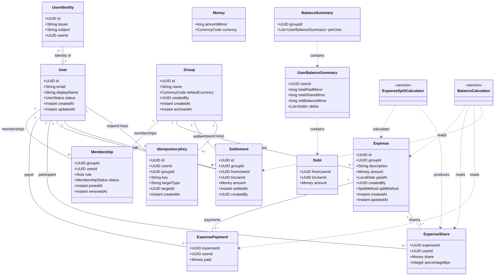

# SplitWise Domain Class Model

This diagram describes the core user, group, expense, settlement, idempotency, and balance-projection models.

## Class Diagram

## Reading the Model

| Area | Responsibility |
|---|---|
| Users and identities | Separates the application user from external authentication identities. |
| Groups and memberships | Models group ownership and user participation through `Membership`. |
| Expenses | Separates who paid (`ExpensePayment`) from who owes (`ExpenseShare`). |
| Settlements | Records money transferred between group members to reduce debt. |
| Idempotency | Associates retry-safe request keys with a user, group, and created target. |
| Balance projections | Represents calculated summaries; these are read models rather than transaction records. |
| Domain services | Calculates expense shares and derives balances from expenses and settlements. |

## Relationship Notation

- `--` — association
- `o--` — aggregation
- `..>` — dependency
- `1..*` — one or more
- `0..*` — zero or more
